# Operational Risk Issue & Remediation Analytics

A synthetic, Basel II-grounded simulation of an enterprise operational risk issue-tracking cycle — built to demonstrate the analytical, SQL, and dashboard skill set required for a Risk Reporting & Analytics role, from raw issue data through Python analysis, SQL cross-validation, and an executive-style Power BI dashboard.

---

## Table of Contents
1. [Project Pipeline & Phases](#project-pipeline--phases)
2. [Business Questions](#business-questions)
3. [Business Problem](#business-problem)
4. [Dataset](#dataset)
5. [Python Analysis](#python-analysis)
6. [SQL Cross-Validation](#sql-cross-validation)
7. [Power BI Dashboard](#power-bi-dashboard)
8. [Automation Layer](#automation-layer)
9. [Tools Used](#tools-used)
10. [Repository Structure](#repository-structure)
11. [Business Understanding](#business-understanding)
12. [Business Recommendation](#business-recommendation)
13. [Business Solution](#business-solution)
14. [Limitations](#limitations)

---

## Project Pipeline & Phases

| Phase | What it covers | Status |
|---|---|---|
| 1. Data Foundation | Synthetic dataset design, grounded in the real Basel II risk taxonomy | Done |
| 2. Python EDA | Trend, root cause, control effectiveness, SLA breach, recurrence analysis | Done |
| 3. SQL Cross-Validation | Independent re-derivation of every Python finding in MySQL | Done |
| 4. Power BI Dashboard | Executive-style KPI dashboard with slicers | Done |
| 5. Automation Layer | Reusable, parameterized Python pipeline (`risk_pipeline.py`) | Done |
| 6. Documentation | This README | Done |

---

## Business Questions

This project was built to answer six concrete questions, the same ones a Risk Reporting & Analytics team asks of its own issue data:

1. **Where is risk concentrated?** Which business unit and risk category combinations generate the most issues?
2. **What's actually breaking?** Do a small number of root causes account for most issues?
3. **Are controls working?** What share of issues stem from a failed control test, and does that share change with severity?
4. **Are issues being fixed on time?** What's the SLA breach rate, and where is it worst?
5. **Are we solving problems or just patching them?** How often does the same root cause recur after being closed?
6. **What's the current risk exposure?** How many issues are open right now, and how old are they?

---

## Business Problem

Financial institutions manage operational risk through a continuous governance cycle: risks are assessed, controls are tested, failures get logged as issues, root causes are investigated, remediation plans are executed, and outcomes are reported to leadership. This project simulates that cycle end-to-end to answer the six business questions above, using a dataset built specifically to mirror the vocabulary and structure of a real enterprise risk-reporting function — Issues, Operational Risk Events (OREs), control testing, and remediation tracking.

---

## Dataset

A synthetic dataset of **2,200 operational risk issues** across **6 business units** over an **18-month window** (Jan 2025–Jun 2026).

Risk categories are grounded in the real **Basel II operational risk taxonomy** — Internal Fraud, External Fraud, Employment Practices & Workplace Safety, Clients/Products & Business Practices, Damage to Physical Assets, Business Disruption & System Failures, and Execution/Delivery & Process Management — rather than invented labels, so the categorization reflects an actual industry standard.

| Column | Description |
|---|---|
| Issue_ID | Unique identifier |
| Business_Unit | One of 6 units (Retail Banking, Cards, Payments Ops, Merchant Services, Digital Channels, Corporate Functions) |
| Risk_Category | One of the 7 Basel II event types |
| Severity | High / Medium / Low |
| Root_Cause_Category | Process Gap, System Failure, Human Error, Third-Party/Vendor, Documentation Gap |
| Control_Test_Result | Pass / Fail |
| Open_Date / Target_Close_Date / Actual_Close_Date | Issue lifecycle dates |
| SLA_Breach | Boolean |
| Recurrence_Flag | Boolean — same Business Unit + Root Cause reopening within 90 days of a prior closure |

No public dataset matches this structure — issue-tracking and control-testing data of this kind is internal and compliance-sensitive at real institutions, so it isn't published (see [Limitations](#limitations) for the three Kaggle datasets evaluated and ruled out).

---

## Python Analysis

Built in Jupyter using pandas and numpy: trend analysis, root cause Pareto analysis, control effectiveness analysis, SLA breach analysis, recurrence analysis, and a current open-exposure snapshot.

**Root cause Pareto** — Process Gap and System Failure together account for 56.2% of all issues:

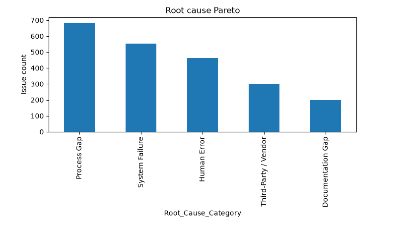

**SLA breach rate by business unit** — breach risk is systemic, not concentrated in one team (41.7%–48.8% range):

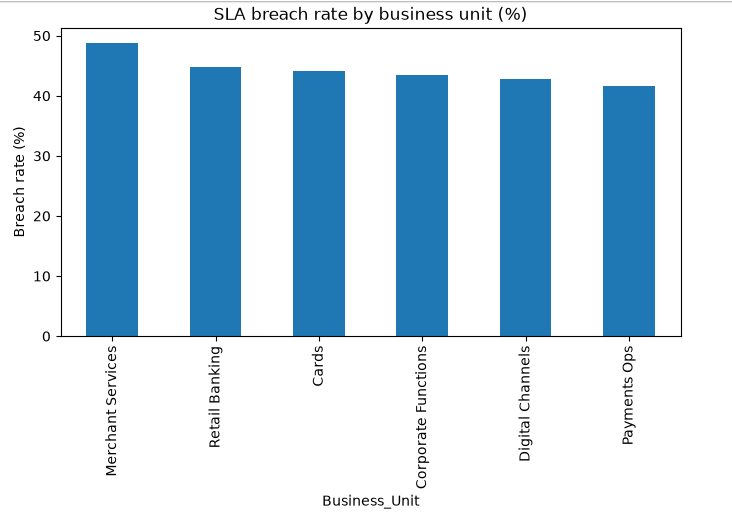

**Issue volume trend by month** — peak in April 2025 at 140 issues, generally stable month to month:

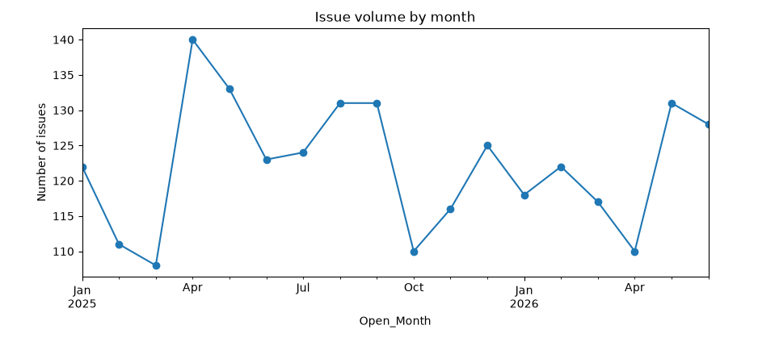

---

## SQL Cross-Validation

Every Python finding was independently re-derived in MySQL to confirm the analysis holds up outside pandas — including a full recomputation of the recurrence flag via a `LAG()` self-join, verified correct not just in aggregate but at the **row level across all 2,200 records**.

**Data quality checks:**

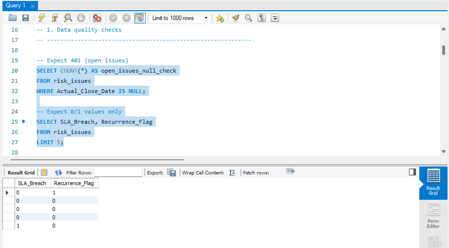

**Issue aging via DATEDIFF:**

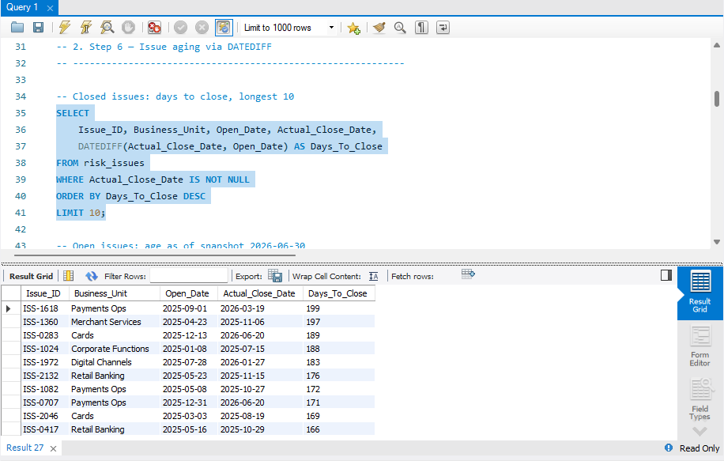

**Open exposure snapshot — 401 open issues, avg 285.3 days old, matching Python exactly:**

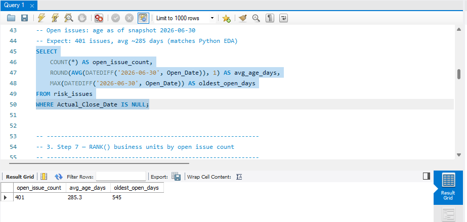

**Business units ranked by open issue count via RANK():**

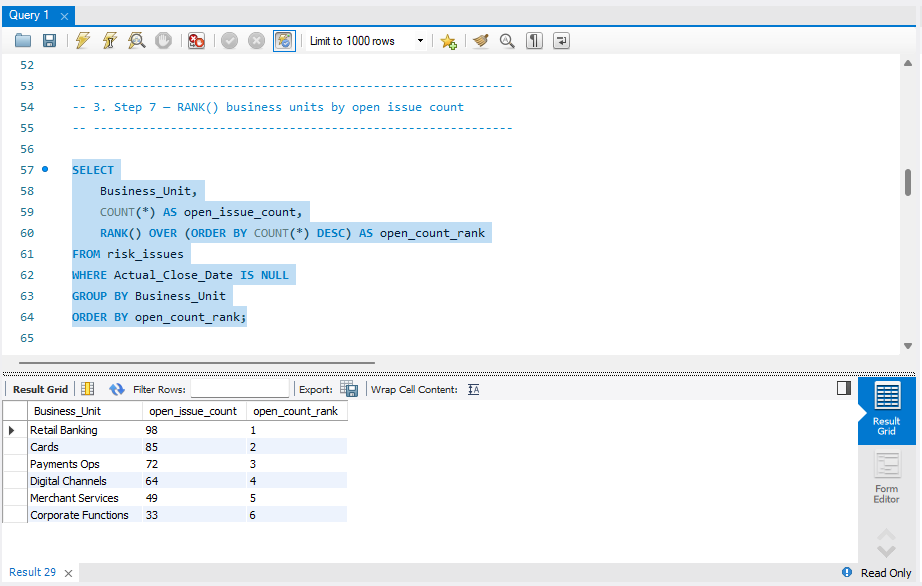

**Recurrence recomputed independently via LAG() — 89 issues, matching Python:**

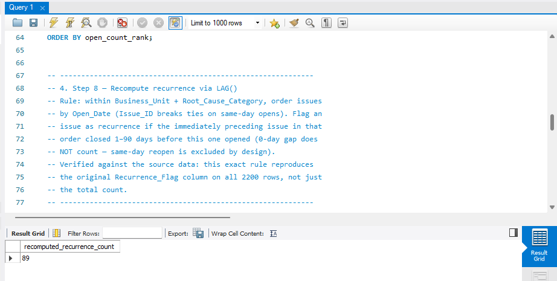

**Recurrence count confirmed to match the original flag exactly:**

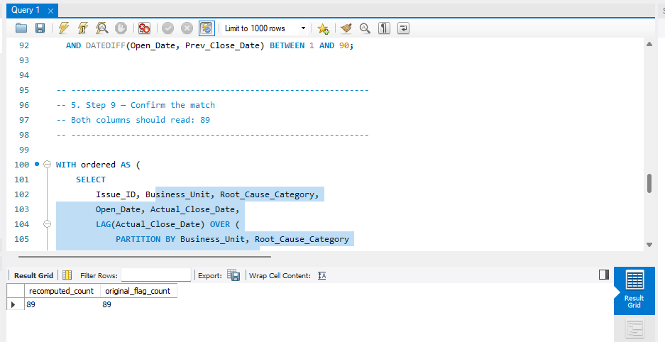

**Control test fail rate by Business Unit x Risk Category:**

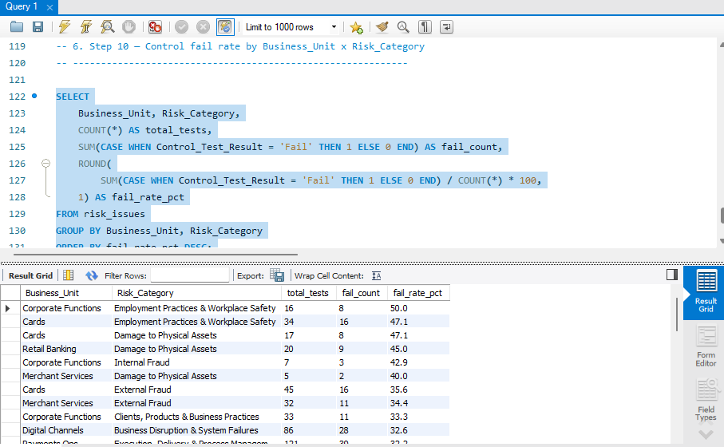

---

## Power BI Dashboard

An executive-style, single-page dashboard built for leadership consumption:
- KPI cards — Open Issues, SLA Breach Rate, High-Severity Open %, Control Fail Rate
- Monthly issue-volume trend line
- Root-cause Pareto bar chart
- Conditionally formatted (traffic-light) control-fail-rate table by business unit
- Top-recurring-issues table
- Slicers for Business Unit, Severity, and Risk Category, enabling self-service exploration

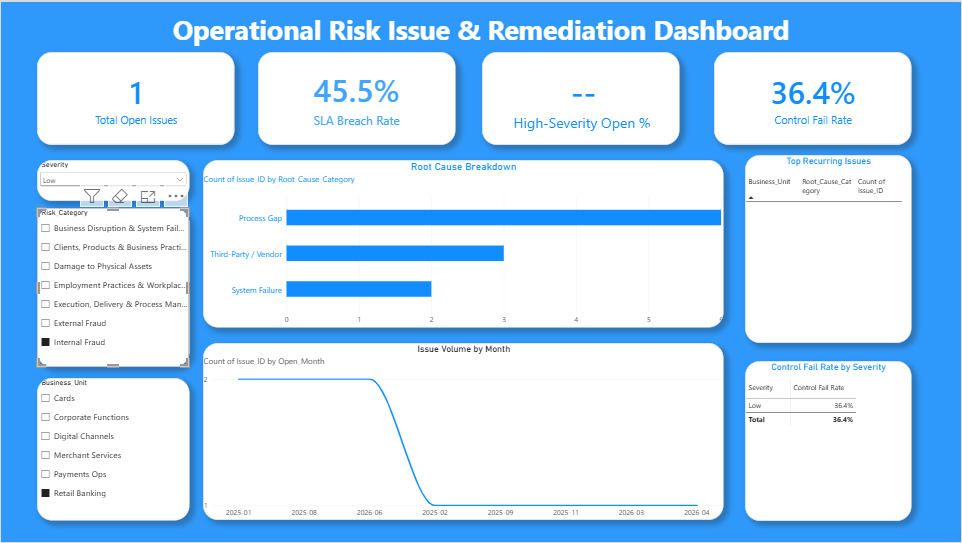
*(Dashboard screenshot)*

A short walkthrough of the dashboard using the slicers is available here:

[Dashboard demo video](./assets/video1.mp4)


---

## Automation Layer

The full Python analysis was refactored from the original notebook into `risk_pipeline.py` — a single reusable script with one function per analysis step and a parameterized `main()` that accepts any new CSV path matching the schema, so the entire pipeline reruns on fresh data (e.g. a future month's export) without any code changes.

Verified two ways:
- **Exact reproduction** — re-running it on the original dataset reproduces every Phase 2 notebook number exactly (peak month, Pareto percentages, fail rates, breach rate, recurrence count, open exposure).
- **Genuine reusability** — run on a second, independently generated dataset (different random seed, different underlying numbers) with zero code changes, and it correctly analyzed the new data end to end.

```
python risk_pipeline.py risk_issues_dataset.csv
```

---

## Tools Used

Python (pandas, numpy), MySQL, Power BI, Microsoft Copilot (code assistance during groupby/aggregation and SQL-writing steps), ChatGPT (structuring and tightening the findings-summary language, based on the raw analysis numbers).

---

## Repository Structure

```
risk-issue-remediation-analytics/
│
├── README.md                          -- this file
├── risk_issues_dataset.csv            -- the synthetic dataset (2,200 rows)
├── risk_issue_eda.ipynb               -- Phase 2: Python EDA notebook
├── risk_pipeline.py                   -- Phase 5: automated, reusable analysis pipeline
├── sql_analysis.sql                   -- Phase 3: SQL cross-validation queries
├── risk_dashboard.pbix                -- Phase 4: Power BI dashboard file
│
└── assets/                            -- all screenshots and the dashboard demo video
    ├── 01_python_root_cause_pareto.png
    ├── 02_python_sla_breach_by_unit.png
    ├── 03_python_issue_volume_trend.png
    ├── 04_sql_data_quality_checks.png
    ├── 05_sql_issue_aging_datediff.png
    ├── 06_sql_open_exposure_snapshot.png
    ├── 07_sql_rank_business_units.png
    ├── 08_sql_recurrence_lag_recompute.png
    ├── 09_sql_recurrence_confirm_match.png
    ├── 10_sql_control_fail_rate.png
    ├── screenshot12.png                -- Power BI dashboard (final version, pending)
    └── video1.mp4                      -- dashboard walkthrough using slicers (pending)
```

---

## Business Understanding

Operational risk issues in this simulation are not evenly distributed — a small set of root causes (Process Gap, System Failure) drive the majority of events, and control effectiveness is far more sensitive to issue severity than to which business unit owns the issue. SLA breaches, by contrast, are a genuinely cross-cutting problem: no single team or category is meaningfully worse than another, which points to a shared, structural remediation bottleneck rather than a team-specific performance issue. Recurrence is rare but real, and it clusters in exactly the areas (Payments Ops, Cards) already carrying the highest open-issue volume — suggesting these units may be under the most sustained operational strain.

## Business Recommendation

1. **Prioritize root-cause remediation over case-by-case fixes** — since Process Gap and System Failure alone account for 56.2% of issues, a targeted process-redesign effort in these two categories would reduce new issue volume more than spreading effort evenly across all five causes.
2. **Investigate the SLA process itself, not individual teams** — because breach rates are flat across business units and severities, the fix likely lies in the remediation workflow or resourcing model generally, not in holding any one team accountable.
3. **Flag Payments Ops and Cards for a deeper root-cause review** — their concentration of both high open-issue counts and recurrence suggests fixes here may be addressing symptoms rather than underlying causes.
4. **Treat control-test failure rate as a severity-driven leading indicator** — since fail rate triples from Low to High severity, tracking this ratio over time could serve as an early warning signal before issues escalate further.

## Business Solution

The Power BI dashboard operationalizes these recommendations into a single view a risk manager can act on directly: KPI cards surface the current open-exposure and breach-rate headline numbers at a glance, the root-cause Pareto chart directs remediation focus toward the highest-leverage categories, the traffic-light control-fail-rate table flags which business unit/category combinations need attention first, and the slicers let a viewer drill into any specific unit, severity, or category without needing a new report built for them each time — turning a static one-time analysis into a reusable, self-service reporting tool.

---

## Limitations

- **This is a synthetic simulation, not real production data.** I do not have real enterprise RCSA/ORE/PRSA experience — this project models the mechanics of that governance cycle using a dataset I built and grounded in the real Basel II taxonomy, to demonstrate understanding of the concepts, not to represent actual work in a live risk system.
- Three Kaggle datasets were evaluated before this decision (`ziya07/operational-risk-events-dataset` — turned out to be loss/capital modeling data, not issue tracking; `sabarostami/risk-analytics-in-banking` — turned out to be a mislabeled credit-default dataset; `zyan1999/corporate-audit-multi-source-dataset` — no longer available). None matched this use case, which is consistent with this type of data generally not being public.
- The `risk_pipeline.py` automation script has been verified to reproduce the notebook's exact analysis output and to correctly re-run on a second, differently-seeded dataset with zero code changes — but has not yet been tested outside this development environment.
- Single-table structure — a real enterprise system would link issues to specific controls, policies, and organizational hierarchy in a relational structure, which this project does not attempt.
